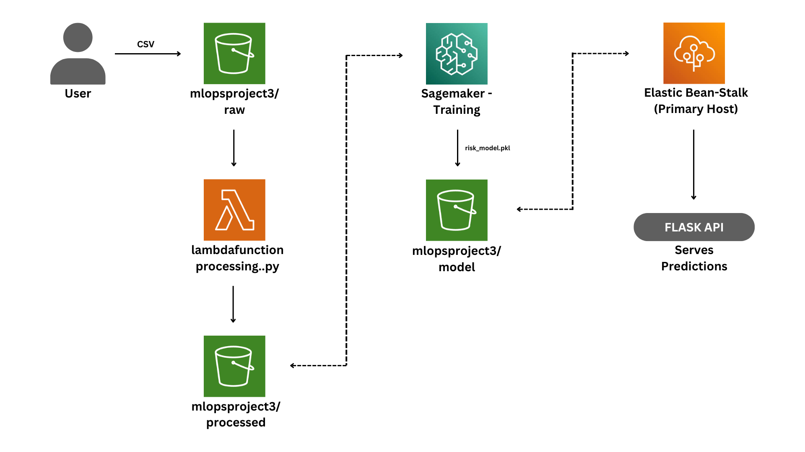

# 💰 AI-Powered Financial Risk Prediction System (AWS MLOps)

A complete end-to-end machine learning project to predict financial risk (e.g., loan default) using AWS services such as S3, Lambda, SageMaker, and Elastic Beanstalk with Dockerized Flask API.

---

## 🚩 Problem Statement

Financial institutions, lenders, and investors face significant challenges in assessing financial risks such as loan defaults, credit risk, and market volatility. Traditional risk evaluation methods often rely on manual reviews and outdated statistical models, leading to delays, inaccuracies, and inefficiencies in decision-making.
To mitigate these issues, we propose an AI-driven Financial Risk Prediction System that leverages machine learning models to predict financial risks with high accuracy. The system automates data ingestion, model training, and deployment using AWS MLOps best practices, ensuring scalability, efficiency, and real-time decision-making for financial institutions.

---

## 💡 Proposed Solution

An automated, AI-powered risk prediction system that:
- Ingests and processes financial data (CSV)
- Trains an ML model using AWS SageMaker
- Deploys a Flask API via Elastic Beanstalk for real-time prediction
- Uses Docker and AWS services for scalable MLOps

---

## ⚙️ Technologies Used

| Service            | Role                                             |
|--------------------|--------------------------------------------------|
| Amazon S3          | Store raw, processed data & model artifacts      |
| AWS Lambda         | Preprocess uploaded data                         |
| Amazon SageMaker   | Train the XGBoost ML model                       |
| Elastic Beanstalk  | Deploy the Flask API using Docker                |
| EC2 + Docker       | Host the containerized prediction API            |
| CloudWatch         | Logs, metrics, and monitoring                    |

---
## 🔄 Workflow

### Stage 1: Data Ingestion
- **Upload Raw Data**:  
  Users upload CSV files (e.g., `Loan_Default.csv`) to the S3 bucket.

---

### Stage 2: Data Preprocessing (AWS Lambda)
- **Trigger**: `S3 PutObject` event in the `raw/` folder.
- **Lambda Function**:
  - Cleans data (handles missing values, encodes categories).
  - Splits data into train/test sets.
  - Saves processed files to `processed/` folder in S3.
- **Code**: `data_preprocessing.py`

---

### Stage 3: Model Training (Amazon SageMaker)
- **Training Job**:
  - Pulls processed data from `s3://financial-risk-mlops/processed/`
  - Uses **XGBoost** algorithm for binary classification.
  - Saves the trained model to `s3://financial-risk-mlops/models/risk_model.pkl`

---

### Stage 4: Model Deployment (Elastic Beanstalk)
- **Flask API**:
  - **Endpoint**: `http://your-env.elasticbeanstalk.com/predict`
  - Loads the latest model from S3 on startup.
  - Accepts JSON input and returns predictions.
- **Docker Container**:
  - Packages the Flask app, dependencies, and environment.

---

### Stage 5: Prediction

**Request Example**:
```bash
curl -X POST http://financial-risk-mlops.env.elasticbeanstalk.com/predict \
     -H "Content-Type: application/json" \
     -d '{
           "loan_amount": 50000,
           "Credit_Score": 700,
           ...
         }'
```

---
## 🧱 Architecture Diagram

This architecture illustrates the complete pipeline from data ingestion to model deployment using AWS services.
